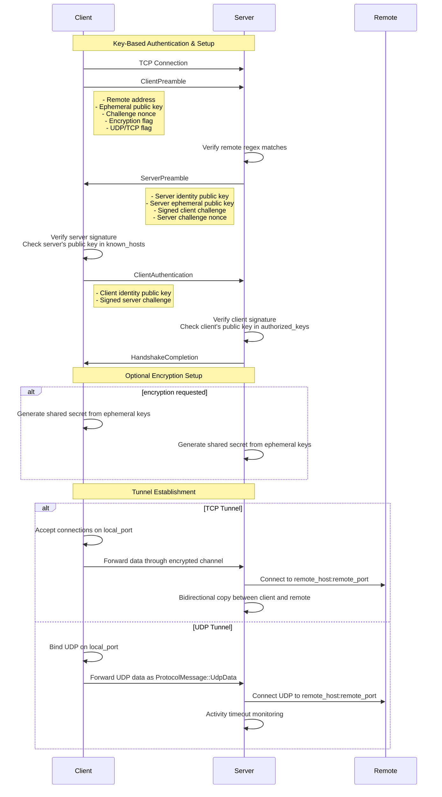

[](https://github.com/twitchax/ratrod/actions/workflows/build.yml)
[](https://codecov.io/gh/twitchax/ratrod)
[](https://crates.io/crates/ratrod)
[](https://crates.io/crates/ratrod)
[](https://github.com/twitchax/ratrod/releases)
[](https://opensource.org/licenses/MIT)

# ratrod

A TCP tunneler that uses public / private key authentication with encryption.  Basically, it's `ssh -L`.  This is useful for tunneling through a machine that doesn't support SSH.

## Usage

```bash
$ ratrod -h
A TCP / UDP tunneler that uses public / private key authentication with encryption.

Usage: ratrod [OPTIONS] [COMMAND]

Commands:
  serve    Start a server on this machine that listens for incoming connections and forwards them to a remote server (as specified by the client)
  connect  Connects to a server and forwards traffic from a local port to a remote `host:port` "through" the server
  help     Print this message or the help of the given subcommand(s)

Options:
  -k, --key-path <KEY_PATH>  Specifies the path to the key store (`key`, `key.pub`, `authorized_keys`, and `known_hosts`)
  -v, --verbose              Flag that specifies verbose logging
  -h, --help                 Print help (see more with '--help')
  -V, --version              Print version
```

Below illustrates a common flow.

### Start a Server

```bash
$ ratrod serve -h
Start a server on this machine that listens for incoming connections and forwards them to a remote server (as specified by the client)

Usage: ratrod serve [OPTIONS] <BIND>

Arguments:
  <BIND>  Specifies the local `host:port` to bind to

Options:
  -r, --remote-regex <REMOTE_REGEX>  Specifies an optional regex restriction on the remote hostnames that can be connected to. This is used to prevent clients from connecting to arbitrary through the server [default: .*]
  -h, --help                         Print help (see more with '--help')
```

First run will ask if you want to generate the keypair.

```bash
$ ratrod serve 0.0.0.0:19000
2025-03-12T22:56:13.939034Z  INFO No security files present in `/home/user/.ratrod` ...
Would you like to have the security files (public / private key pair, known hosts, and authorized keys) generated (y/n)?
```

If you choose `y`, it will generate the keypair and store it in `$HOME/.ratrod/key` and `$HOME/.ratrod/key.pub`.  An empty `known_hosts` and `authorized_keys` file will also be created.

If you specify a keypath, it will look / generate into that directory.

```bash
$ ratrod -k keys serve 0.0.0.0:19000
2025-03-12T22:57:53.493477Z  INFO No security files present in `keys` ...
Would you like to have the security files (public / private key pair, known hosts, and authorized keys) generated (y/n)? y
2025-03-12T22:57:55.535365Z  INFO Generating security files ...
2025-03-12T22:57:55.535986Z  INFO 📦 Security files written to `keys/key`
2025-03-12T22:57:55.536653Z  INFO 🚀 Starting server on `0.0.0.0:19000` ...
```

Basic usage pulls the key from the default location (`$HOME/.ratrod/key.pub`).

```bash
$ ratrod serve 0.0.0.0:19000
2025-03-12T22:59:24.072923Z  INFO 🚀 Starting server on `0.0.0.0:19000` ...
```

Otherwise, you can specify the keypath with the `--key` (`-k`) flag.
Or, pass the keyfile.

```bash
$ ratrod -k ~/mykeys serve 0.0.0.0:19000
```

### Connect to a Server

```bash
$ ratrod connect -h
Connects to a server and forwards traffic from a local port to a remote `host:port` "through" the server

Usage: ratrod connect [OPTIONS] <SERVER> [TUNNEL]...

Arguments:
  <SERVER>     Specifies the server's `host:port` to connect to
  [TUNNEL]...  Specifies the remote(s) (e.g., `client_port:host:remote_port`) that the client wishes the server to route the traffic to

Options:
  -a, --accept-all-hosts  Specifies that all server public keys should be accepted
  -e, --encrypt           Specifies whether to encrypt the traffic between the client and server
  -h, --help              Print help (see more with '--help')
```

First run will ask if you want to generate the keypair.

```bash
$ ratrod connect 192.168.1.100:19000 2000:google.com:80
2025-03-12T22:56:13.939034Z  INFO No security files present in `/home/user/.ratrod` ...
Would you like to have the security files (public / private key pair, known hosts, and authorized keys) generated (y/n)?
```

At this point, you should make sure the server adds your public key to the `authorized_keys` file on the server.  This is done by copying the contents of `key.pub` to the server's `authorized_keys` file.

Usage is as simple as (assuming you're using the default keyfile location):

```bash
$ ratrod connect 192.168.1.100:19000 2000:google.com:80
2025-03-12T23:02:55.563197Z  INFO ⏳ Testing server connection ...
2025-03-12T23:02:55.563274Z  INFO 📻 [TCP] Listening on `127.0.0.1:2000`, and routing through `192.168.1.100:19000` to `google.com:80` ...
2025-03-12T23:02:55.563282Z  INFO 📻 [UDP] Listening on `127.0.0.1:2000`, and routing through `192.168.1.100:19000` to `google.com:80` ...
2025-03-12T23:02:55.563378Z  INFO ✅ Connected to server `192.168.1.100:19000` ...
2025-03-12T23:02:55.563496Z  INFO ✅ Sent preamble to server ...
2025-03-12T23:02:55.563886Z  INFO ✅ Server's signature validated with public key `OLtgafdheGshrj5EzuuS0c30UL2KVZDTaX7N5bSI8Zo` ...
2025-03-12T23:02:55.563908Z ERROR ❌ Test connection failed: Server's public key `OLtgafdheGshrj5EzuuS0c30UL2KVZDTaX7N5bSI8Zo` is not in the known hosts file
```

You will have to make sure the server's public key is in the `known_hosts` file.  Or, you can use the `--accept-all-hosts` (`-a`) flag to accept all server public keys.

```bash
$ ratrod connect -a 192.168.1.100:19000 2000:google.com:80
2025-03-12T23:08:03.680555Z  INFO ⏳ Testing server connection ...
2025-03-12T23:08:03.680580Z  INFO 📻 [UDP] Listening on `127.0.0.1:2000`, and routing through `192.168.1.100:19000` to `google.com:80` ...
2025-03-12T23:08:03.680582Z  INFO 📻 [TCP] Listening on `127.0.0.1:2000`, and routing through `192.168.1.100:19000` to `google.com:80` ...
2025-03-12T23:08:03.680789Z  INFO ✅ Connected to server `192.168.1.100:19000` ...
2025-03-12T23:08:03.680903Z  INFO ✅ Sent preamble to server ...
2025-03-12T23:08:03.681392Z  INFO ✅ Server's signature validated with public key `OLtgafdheGshrj5EzuuS0c30UL2KVZDTaX7N5bSI8Zo` ...
2025-03-12T23:08:03.681405Z  INFO 🚧 Signing server challenge ...
2025-03-12T23:08:03.681497Z  INFO ⏳ Awaiting challenge validation ...
2025-03-12T23:08:03.681740Z  INFO ✅ Challenge accepted!
2025-03-12T23:08:03.681751Z  INFO ✅ Test connection successful!
```

If you want to use encryption, you can specify the `--encrypt` (`-e`) flag.

```bash
$ ratrod connect -e 192.168.1.100:19000 2000:google.com:80
```

The client and server will each generate an ephemeral keypair for each connection, and they will generate a shared secret using the
[Diffie-Hellman key exchange algorithm](https://cryptography.io/en/latest/hazmat/primitives/asymmetric/x25519/).
The shared secret is used to encrypt the traffic between the client and server after the handshake (handshake is plaintext).

### Tunnel Format

The `host` argument accepts the form `[local_host:[local_port:[remote_host:]]]remote_port`.  This means you could have various scenarios like this:
- `0.0.0.0:2000:google.com:80`: server connects to `google.com:80` and client listens on `0.0.0.0:2000`.
- `2000:google.com:80`: server connects to `google.com:80` and client listens on `127.0.0.1:2000`.
- `2000:80`: server connects to `server:80` (as in, its own `127.0.0.1:80`) and client listens on `127.0.0.1:2000`.
- `80`: server connects to `server:80` (as in, its own `127.0.0.1:80`) and client listens on `127.0.0.1:80`.

## Install

Windows:

```powershell
$ iwr https://github.com/twitchax/ratrod/releases/latest/download/ratrod_x86_64-pc-windows-gnu.zip
$ Expand-Archive ratrod_x86_64-pc-windows-gnu.zip -DestinationPath C:\Users\%USERNAME%\AppData\Local\Programs\ratrod
```

Mac OS (Apple Silicon):

```bash
$ curl -LO https://github.com/twitchax/ratrod/releases/latest/download/ratrod_aarch64-apple-darwin.zip
$ unzip ratrod_aarch64-apple-darwin.zip -d /usr/local/bin
$ chmod a+x /usr/local/bin/ratrod
```

Linux:

```bash
$ curl -LO https://github.com/twitchax/ratrod/releases/latest/downloadratrod_x86_64-unknown-linux-gnu.zip
$ unzip ratrod_x86_64-unknown-linux-gnu.zip -d /usr/local/bin
$ chmod a+x /usr/local/bin/ratrod
```

Cargo:

```bash
$ cargo install ratrod
```

## Protocol



## Etymology

It a reference to the [Rat Rod](https://en.wikipedia.org/wiki/Rat_rod) car culture, which is all about building something that works, even if it's "rusty".

Essentially, I googled "rusty pipe", and didn;t get much, so I googled "rusty rod", and google figured I meant "rat rod".  I thought it was appropriately esoteric, so I went with it.

## Testing

```bash
$ cargo nextest run
```

## License

This project is licensed under the MIT License - see the [LICENSE](LICENSE) file for details.